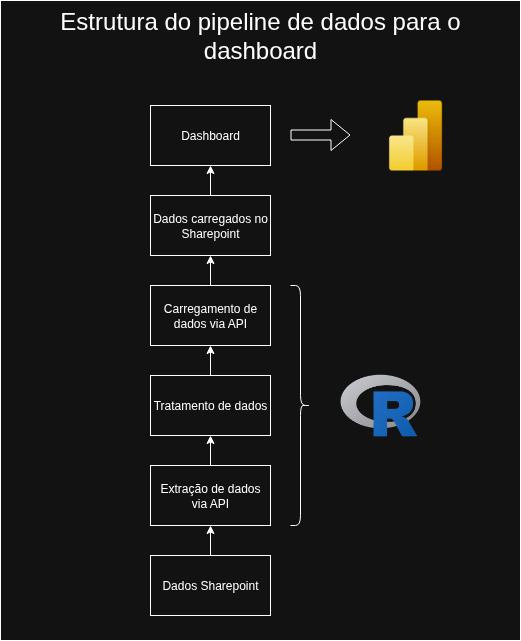
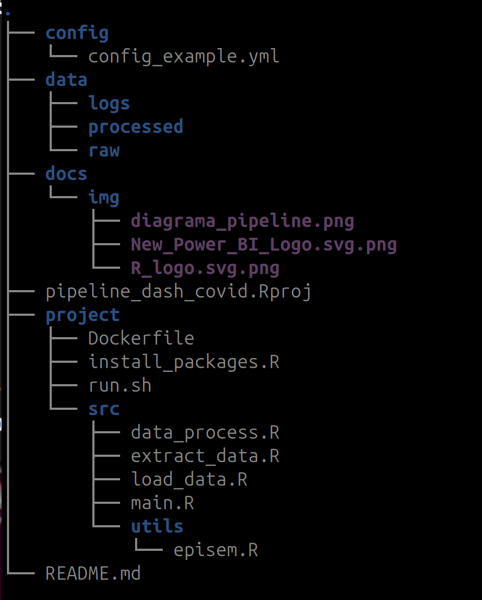

# Pipeline de dados do e-SUS Notifica para o painel de síndrome gripal pela covid-19

Pipeline de dados com processo de ETL deenvolvido para alimentar o painel de síndrome gripal pela covid-19 do Ministério da Saúde.

## Sobre o projeto

Este projeto foi desenvolvido para realizar o tratamento de dados, com aplicação de regras de negócio, para consumo pelo dashboard epidemiológico da vigilância da síndrome gripal pela covid-19.

### Objetivos

* Gerar faixas etárias a partir da data de nascimento
* Calcular semanas epidemiológicas
* Aplicar regra para criação da variável "Caso novo"
* Corrigir erros em noems de categorias das variáveis
* Codificar valores ausentes
* Criar variáveis para grupos de risco e populações específicas

## Tecnologias utilizadas

**Programação**
* R - Linguagem de programação estatística

!!!A linguagem de programação R foi adotada por ser a utilizada pela área de negócios, que também faz sugestões e alterações no tratamento de dados. O uso da mesma linguagem torna as implementações de atualizações mais ágeis.

**Ferramentas**
* Docker - Conteinerização do código fonte

## Estrutura do pipeline



## Como utilizar o app
1. Baixar o projeto do github
```
git pull origin https://github.com/cnie-int/pipeline_dash_covid.git
```

2. Criar arquivos de configuração:

Exemplo de como criar deve ser configurado arquivo .env
```
TENANT_ID="exemplo tenant ID"
CLIENT_ID="exemplo client ID"
CLIENT_SECRET="exemplo password"
```

Exemplo de como deve ser configurado o arquivo config/config.yml
```
paths:
  path_data: "./data/raw/dados.parquet"
  path_cgcovid_package: "./utils/episem.R"
  path_output: "./data/processed/dados.csv"

sharepoint:
  pasta_arquivo: "projeto/data/raw"
  caminho_input: "General/diretorio/remoto/sharepoint/dados.parquet"
  site_name: "nome_do_site_sharepoint"

sharepoint_output:
  pasta_arquivo_output: "projeto/data/processed/dados.csv"
  nome_arquivo_output: "dados.csv"
  caminho_output: "General/diretorio/remoto/sharepoint/Dados"
  site_name_output: "nome_do_site_sharepoint"
  
```

3. Executar a aplicação
```
Rscript main.R
```

## Estrutura do Projeto



Desenvolvido por Pedro de Sá <85pedrosa@gmail.com>